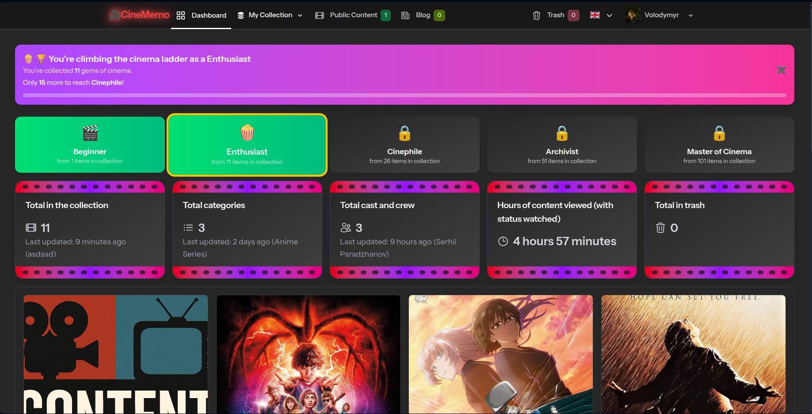
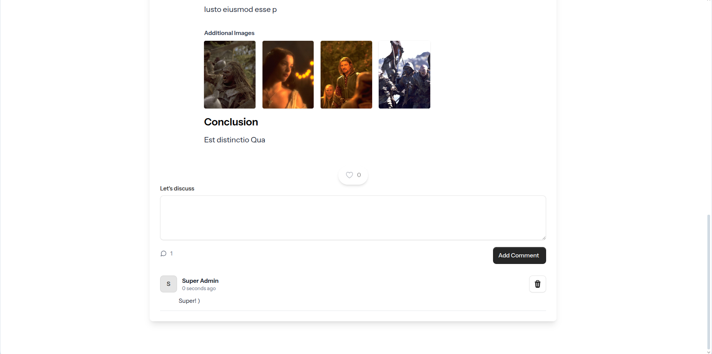

# 🎬 CineMemo

**CineMemo** is a personal media tracker built with Laravel. It helps users keep notes about what they’ve watched — whether it's a movie, series, anime, or any other media type. Organize your thoughts, track your progress, and never forget what you’ve seen.

---

## 🚀 Features

- ✍️ Add notes about any content you watch
- 🎞️ Categorize content by type (Movie, Serial, Anime, etc.)
- 🏷️ Add genres, statuses (e.g., Watching, Watched), and tags
- 📁 Upload related images or posters
- 📊 Filter and search through your library
- 🌟 Recommendation system based on your most favorite genres
- 🏆 Levels & Gamification
- 💬 Comment system with likes
- 🔒 Public and private content visibility
- 📄 Articles 
- 🌗 Light & dark mode ready (optional)
- 🔐 User authentication and personal data separation

---

## 🛡️ Roles & Permissions

The application includes a role-based management system:

- **Super Admin**: Full system access, manage all users, roles, and content  
- **Admin**: Manage categories, content items, articles, and moderate user activity  
- **Writer**: Create and manage their own content and articles  
- **User**: Create personal notes, manage their media library, comment, and interact with others  

---
## 🎬 Cinema Levels & Gamification

To make collecting movies/series more engaging, the dashboard includes a cinema level system with milestones, badges, and progress tracking.

- **Levels & Badges**:

    - 🎬 **Beginner** — 1+ items

    - 🍿 **Enthusiast** — 11+ items

    - 🌟 **Cinephile** — 26+ items

    - 🏆 **Archivist** — 51+ items

    - 🎥 **Master of Cinema** — 101+ items

- **Features**:

    - Dynamic banner with rotating motivational messages (powered by Alpine.js).

    - Current progress display: shows how many gems you’ve collected and how many remain to reach the next level.

    - **Badge Showcase Grid**: visual grid of all levels, with unlocked/locked states, so users can see achievements already earned and milestones ahead.

    This system adds **gamification** and encourages users to grow their collection of cinematic gems.


---

## 📬 Contact Form

The application includes a Livewire-powered contact form on the welcome page.  
Users can send messages directly, and the app will dispatch an email to the configured support address.

### Features
- Livewire 3 component (`ContactForm`) with real-time validation
- Sends email via Laravel Mail system
- Flash message feedback with Alpine.js animations
- Rate limiting to prevent spam submissions

### Configuration

Set up your mail driver in `.env`:

```env
MAIL_MAILER=smtp
MAIL_HOST=smtp.mailtrap.io
MAIL_PORT=2525
MAIL_USERNAME=your_mailtrap_user
MAIL_PASSWORD=your_mailtrap_pass
MAIL_ENCRYPTION=tls
MAIL_FROM_ADDRESS="hello@example.com"
MAIL_FROM_NAME="YourApp"
```

For local development, you can use:

```MAIL_MAILER=log```
This will log outgoing emails to `storage/logs/laravel.log` instead of sending them.

## 📦 Tech Stack

- Laravel 12
- Livewire 3 
- Tailwind CSS
- Alpine.js
- MySQL / SQLite

---

## ⚙️ Installation

### Prerequisites

* PHP >= 8.2
* Composer
* Laravel
* Node.js & npm

### Steps

1. 🧬 Clone the repository

    ```git clone https://github.com/Volodymyr0587/laravel-cinememo```

    ```cd laravel-cinememo```

2. 📦 Install dependencies

    ```composer install```

    ```npm install```

3. 📝 Set up the environment

    ```cp .env.example .env```

    ```php artisan key:generate```

4. 🗄️ Database setup

    Using SQLite for simplicity. Update your .env file accordingly:

    ```DB_CONNECTION=sqlite```

5. 🔧 Run migrations with seeders

    ```php artisan migrate:fresh --seed```

    This will create:

    - `Super admin` user (email: superadmin@gmail.com, password: `password123`)
    - `Admin` user (email: admin@gmail.com, password: `password123`)
    - `Writer` user (email: writer@gmail.com, password: `password123`)
    - `Regular user` (email: volodymyr@gmail.com, password: `password123`) 

    and some data to explore for Regular user.

6. 🔗 Create a symbolic link for storage

    ```php artisan storage:link```

7. 🚀 Serve the Application

    You can start the application in two ways:

    * Option 1 — Run each service manually:

        ```npm run dev```

        ```php artisan queue:work```

        ```php artisan serve```


    * Option 2 — Use a single Composer command:

        ```composer run dev```
    
        This command will automatically start the Vite dev server and prepare the app for local development.

## Usage

Register a new user and start managing your favorite content.

## Examples of application appearance





